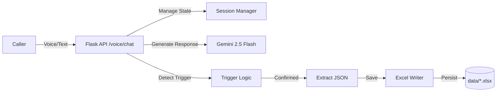

# AI Voice Callbot (Gemini + Excel)

An intelligent voice bot backend that simulates phone conversations, collects booking/order details, and saves them to Excel—deterministically and safely.

## 🏗 Architecture



## 🚀 Features

- **Conversational Intelligence**: Uses Google Gemini to speak naturally.
- **Strict Data Collection**: Follows `prompts/booking.md` to ask one question at a time.
- **Deterministic Logic**: Only saves data when the user explicitly confirms (`confirmation.md`).
- **Structured Data**: Extracts JSON (`extract_structured_data.md`) and saves to Excel.
- **Minimal API Usage**: Caches sessions, prevents duplicate extraction, uses strict triggers.

## 🛠 Setup

### Prerequisities
- Python 3.10+
- Google Gemini API Key

### Installation
1. Clone the repo.
2. Install dependencies:
   ```bash
   pip install -r requirements.txt
   ```
3. Create `.env`:
   ```env
   GEMINI_API_KEY=your_key_here
   ```

## 🏃‍♂️ Usage

### 1. Run the Backend
```bash
python backend/app.py
```
Server starts on `http://localhost:5000`.

### 2. Simulate a Call
Run the included test script to simulate a user talking to the bot:
```bash
python tests/test_voice_flow.py
```
*Note: Waits 10s between turns to avoid Gemini Free Tier rate limits.*

### 3. Check Data
Appointments are saved to: `data/appointments.xlsx`
Orders are saved to: `data/orders.xlsx`

## 🧠 Prompt Engineering
The system behavior is strictly controlled by markdown files in `prompts/`:
- **`system.md`**: Core persona and constraints.
- **`booking.md`**: Rules for collecting data (one field at a time).
- **`confirmation.md`**: Rules for confirming data before saving.
- **`extract_structured_data.md`**: JSON schema for extraction.

## ⚠️ Limitations
- **Rate Limits**: Configured for Gemini Free Tier (occasional 429s).
- **Persistence**: Local Excel files (not a database).
- **Voice**: Currently textual simulation (`/voice/chat`). Connects to Twilio/Vapi via the same API structure.

## 🛡 Safety & Failure Modes
- **Privacy**: No audio stored, only text transcripts in memory.
- **Hallucination**: System prompt explicitly forbids inventing data.
- **Fallback**: `fallback.md` handles off-topic or unclear inputs.
